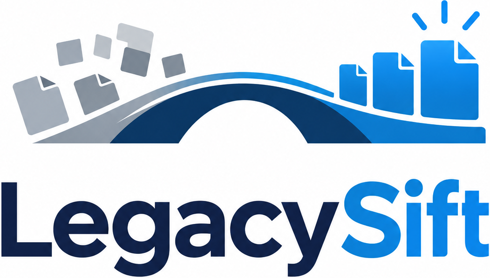

# LegacySift

  

LegacySift is a simple, safe tool for comparing a folder recovered from an old computer, disk, or backup with the folder you use today.

Its direction is intentionally fixed:

- **OLD folder**: the folder that may be cleaned.
- **CURRENT folder**: the protected reference, used only for comparison.

LegacySift answers one question:

> What is still in the old folder that I do not already have in the current folder?

During comparison, nothing is modified. Exact duplicates can later be moved out of the old folder into a recoverable safety folder. The current folder is never cleaned.

## Design goals

- understandable without technical knowledge;
- no left/right ambiguity;
- current folder clearly marked as protected/read-only;
- exact-content comparison;
- reversible cleanup by default;
- no administrator privileges required;
- local-only operation, with no upload, telemetry, or online account;
- multilingual user interface.

## Languages

The current alpha includes 34 interface languages:

English, Italian, Bengali, Bulgarian, Simplified Chinese, Croatian, Czech, Danish, Dutch, Estonian, Filipino, Finnish, French, German, Greek, Hindi, Hungarian, Indonesian, Japanese, Korean, Latvian, Lithuanian, Malay, Norwegian Bokmål, Polish, Portuguese, Romanian, Slovak, Spanish, Swedish, Thai, Turkish, Ukrainian and Vietnamese.

LegacySift follows the Windows UI language when it is supported and otherwise uses English. The language chooser deliberately stays easy to recover: it always shows a lightweight flag, the language's own name, its English name and a visible language code. The entry point remains **Language / Lingua** even when the rest of the interface uses another language.

Arabic, Hebrew, Persian and Urdu are deferred because right-to-left layout needs to be designed and tested rather than treated as a text-only translation.

Russian is not included. A Windows Russian UI or an old saved `ru` preference safely falls back to English.

See [Localization](docs/LOCALIZATION.md) and [UI layout QA](docs/UI_LAYOUT_QA.md) for the maintained language codes and automated layout matrix.

## Status

LegacySift 0.2.3-alpha is currently in alpha development. It includes the refined light/dark visual system and the System/Light/Dark preference while preserving the 34-language safety workflow. Do not use an alpha build as the only copy of important data.

See [Visual identity and themes](docs/VISUAL_THEME.md) for the asset locations, theme behavior and deliberate native-control compromises.

## License

LegacySift is released under the MIT License.
